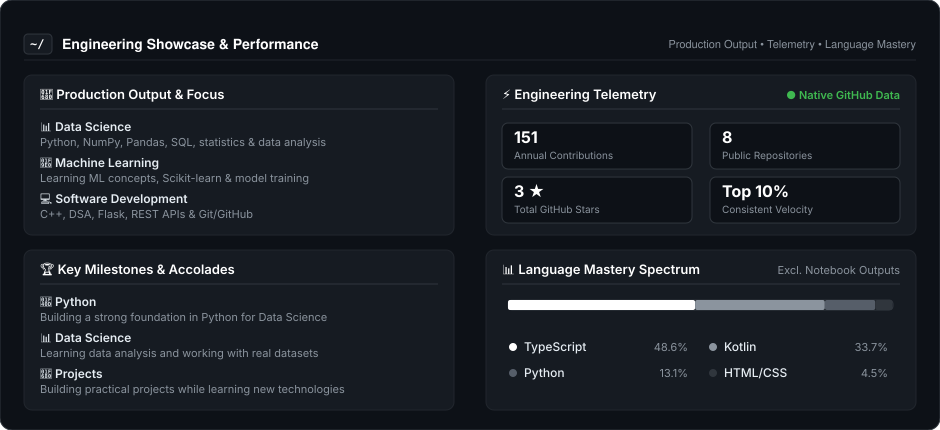

<<<<<<< HEAD
<<<<<<< HEAD
  
=======
  
>>>>>>> 8c010b3 (photo update)
=======
  
>>>>>>> a8c09e5719075be94e1fa5a5e72a8395811d65c3
  
    

  # Abhinav Yadav
  
  

    
  

  ### 🚀 Building, Learning & Shipping
  
  **Data Science • Python • Machine Learning Enthusiast**

   

  
  &nbsp;
  
  &nbsp;
  

---

### 👨‍💻 About Me

I'm a **BTech Computer Science student** focused on **Data Science, Machine Learning, and Software Development**.

* 🐍 **Currently:** Strengthening my skills in **Python, NumPy, Pandas, SQL, Statistics, and Machine Learning**.
* 📊 **Data Science:** Building practical projects to improve my data analysis and problem-solving skills.
* 🤖 **AI Focus:** Exploring **Machine Learning, Scikit-learn, and model training**.
* 💻 **Development:** Also learning **C++, DSA, Flask, REST APIs, Git, and GitHub**.
* 🎯 **Goal:** Become a skilled **Data Scientist / ML Engineer** and work on real-world problems.

---

### 📡 Technical Capability & Skills Radar

  

---

### 🛠️ Core Tooling & Technologies

| **Category** | **Technologies** |
| :--- | :--- |
| **Programming** |  |
| **Data Science** |  |
| **AI & Machine Learning** |  |
| **Backend & Tools** |  |

---

### 📈 Activity & Contribution Flow

  

---

### ⚡ Engineering Showcase & Performance

  

---

### 🎮 The Human Side

I'm not just a code machine. When the IDE closes, here is who I am:

* **🎮 Gaming:** I enjoy gaming when I'm away from coding and studying.
* **🌐 Exploring:** I like exploring new technologies and learning how things work.
* **💻 Building:** I learn best by turning what I learn into practical projects.

---

  Let's build something meaningful together.

